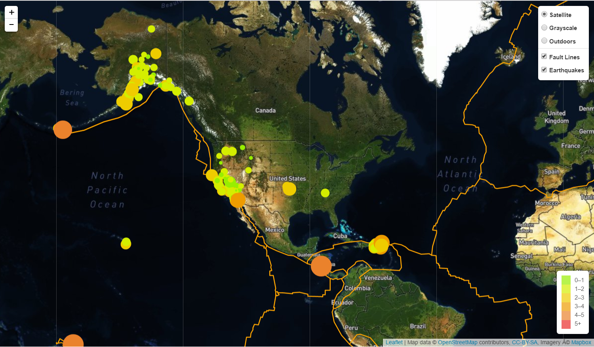

# Leaflet Challenge - Visualizing Earthquake Geodata with Leaflet

##### Web application is deployed at the following [link](https://qianyuema.github.io/leaflet-challenge/) (API key removed).

Welcome to the United States Geological Survey, or USGS for short! The USGS is responsible for providing scientific data about natural hazards, the health of our ecosystems and environment; and the impacts of climate and land-use change. Their scientists develop new methods and tools to supply timely, relevant, and useful information about the Earth and its processes. The USGS is interested in building a new set of tools that will allow them visualize their earthquake data. They collect a massive amount of data from all over the world each day, but they lack a meaningful way of displaying it. 

#### Their hope is that being able to build a new set of tools to visualize their earthquake data will allow them to better educate the public and other government organizations (and hopefully secure more funding..) on issues facing our planet.

## Tasks

### Level 1: Basic Visualization of an Earthquake Dataset

1. **Get your data set**

   The USGS provides earthquake data in a number of different formats, updated every 5 minutes. Visit the [USGS GeoJSON Feed](http://earthquake.usgs.gov/earthquakes/feed/v1.0/geojson.php) page and pick a data set to visualize. When you click on a data set, for example 'All Earthquakes from the Past 7 Days', you will be given a JSON representation of that data. You will be using the URL of this JSON to pull in the data for our visualization.

   

2. **Import & Visualize the Data**

   Create a map using Leaflet that plots all of the earthquakes from the dataset based on their longitude and latitude.

   * Data markers should reflect the magnitude of the earthquake in their size and colour. Earthquakes with higher magnitudes should appear larger and darker in colour.

   * Include popups that provide additional information about the earthquake when a marker is clicked.

   * Create a legend that will provide context for your map data.

- - -

### Level 2: More Data (Optional)

The USGS wants to plot a second dataset on your map to illustrate the relationship between tectonic plates and seismic activity. Pull in a second data set and visualize it along side your original set of data. Data on tectonic plates can be found at <https://github.com/fraxen/tectonicplates>, with the direct access from the [GitHub page here](https://raw.githubusercontent.com/fraxen/tectonicplates/master/GeoJSON/PB2002_boundaries.json).

In this step,

* Plot a second data set on our map.
* Add a number of base maps to choose from as well as separate out our two different data sets into overlays that can be turned on and off independently.
* Add layer controls to our map.

### Level 3: Time Keeps on Ticking (Optional)

Many people don't know how much seismic activity is happening around them all the time. Did you know that Southern California has over 10,000 earthquakes each year alone? The USGS wants to create a map that will visualize just how many earthquakes happen over the course of a day/week.

* Use a Leaflet plugin (they can be found at <http://leafletjs.com/plugins.html>) to visualize the earthquakes as it takes place over a period of time.

- - -

### Level 4: Above and Beyond (Optional)

So excited to be in this new position and really want to do something that will blow them away! So, two new ideas of ways to go above and beyond:

* Find another set of geospatial data that can be used to show a new correlation or insight about the existing earthquake data.

* Use additional plug-ins from the [Leaflet Documentation](http://leafletjs.com/plugins.html) to further visualize our data in a unique way.

  * Heatmap
    

  * Data Clustering
    

